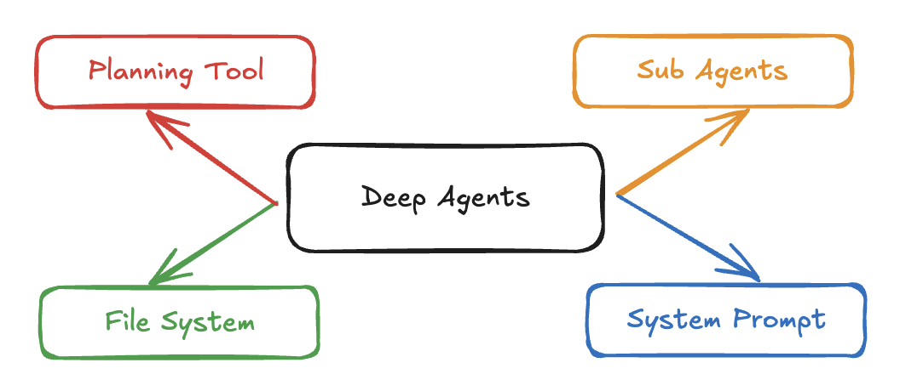

使用 LLM 在循环中调用工具是最简单的智能体形式。然而，这种架构可能会导致智能体“浅薄”，无法规划和执行更长时间、更复杂的任务。“ Deep Research ”、“ Manus ”和“ Claude Code ”等应用程序通过结合以下四项功能来克服这一局限性：规划工具、子智能体、文件系统访问权限和详细提示。

致谢：本次探索主要受到 Claude Code 的启发，以及人们将其用于编码以外其他用途的报道。Claude Code 的哪些特性使其成为通用代码？我们能否提炼并概括这些特性？

# Deep agents in the wild

目前占主导地位的 agent 架构也是最简单的：在一个循环中运行，调用工具。

然而，简单地这样做会导致智能体能力较弱。“能力较弱”指的是智能体无法进行长期规划和执行更复杂的任务。

研究和编程领域涌现出两个打破这一趋势的智能体。所有主流模型提供商都提供了用于深度研究和“异步”编程任务的智能体。许多初创公司和客户正在为各自的垂直行业开发这些智能体。

我将这些智能体称为“深度智能体”，因为它们能够深入研究特定主题。它们通常能够规划更复杂的任务，并在更长的时间跨度内执行这些目标。

这些 agent 擅长深入调查的原因是什么？

核心算法其实是一样的——都是一个循环运行的 LLM（逻辑逻辑管理器）调用各种工具。与易于构建的简单代理相比，区别在于：

- A detailed system prompt：详细的系统提示
- Planning tool 规划工具
- Sub agents 子代理
- File system 文件系统

# Characteristics of deep agents

### Detailed system prompt

Claude Code 重新编写的系统提示信息很长，其中包含如何使用工具的详细说明，以及在特定情况下如何操作的示例（少量提示）。

> 可以去看源码，足足有 1699 行。

Claude Code 并非个例——大多数优秀的编程或深度研究智能体都拥有相当复杂的系统提示。如果没有这些系统提示，智能体的能力就不会如此强大。提示仍然至关重要！

### Planning tool

Claude Code 使用了一个待办事项列表工具 。有趣的是，它实际上什么也不做！它基本上是一个空操作。这只是一种上下文工程策略，旨在确保智能体始终朝着正确的方向前进。

> https://claudelog.com/faqs/what-is-todo-list-in-claude-code/?ref=blog.langchain.com

深度智能体更擅长执行时间跨度较长的复杂任务。规划（即使是通过空操作工具调用完成）是其中的重要组成部分。

### Sub agents

Claude Code 可以生成子代理 ，从而实现任务拆分。您还可以创建自定义子代理以获得更多控制权，例如 “上下文管理和提示快捷方式” 。

深度智能体能够深入研究特定主题。这主要是通过创建专门针对特定任务的子智能体，并允许这些子智能体在该领域进行深入探索来实现的。

### File System

克劳德代码（显然）拥有文件系统的访问权限，可以修改其中的文件，不仅是为了完成任务，也是为了记录笔记。它还充当所有代理（及其子代理）协作的共享工作空间。

Manus 是另一个深度代理的例子，它大量使用文件系统作为“内存”。

深度代理程序长时间运行，会积累大量需要管理的上下文信息。为此，配备一个方便的文件系统来存储（并在之后读取）这些信息会很有帮助。

> https://blog.langchain.com/deep-agents/
